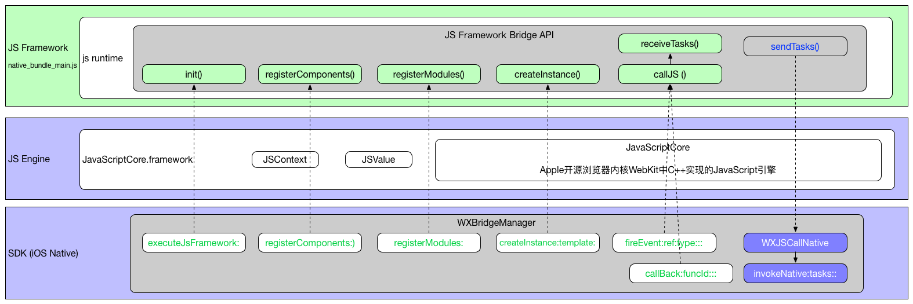

# 二、Weex SDK : JS Framework Bridge APIs

分别从FE工程师和NA工程师视角来看JS Framework Bridge APIs概貌。

## 零、JS Framework Bridge APIs概貌



## 一、从JS视角看Bridge (JavaScript语法)

从JS视角看到的Bridge都是纯正的JavaScript语法（全局函数）。

### 1.1、Called by native and supplied from JS Framework

- `createInstance(instanceId, code, options, data)`
- `destroyInstance(instanceId)`
- `refreshInstance(instanceId, data)`
- `registerComponents(components)`
- `registerModules(modules)`
- `getRoot(instanceId)`
- `receiveTasks(instanceId, tasks)` <==> `callJS(instanceId, tasks)`

### 1.2、Called from JavaScript and implemented with native code

- `sendTasks(instanceId, tasks)` <==> `callNative(instanceId, tasks)`

```
// html5/runtime/bridge/TaskCenter.js

export function init () {
  TaskCenter.prototype.componentHandler = global.callNativeComponent;
  TaskCenter.prototype.moduleHandler = global.callNativeModule;
}
```

Example:

```javascript
sendTasks('x', [
  {module: 'dom', method: 'addElement', args: ['_root', {ref: '1', type: 'container'}, -1]},
  {module: 'dom', method: 'addElement', args: ['1', {ref: '2', type: 'text', ...}, -1]},
  {module: 'dom', method: 'addElement', args: ['1', {ref: '3', type: 'image', ...}, -1]},
  ...
])
```

```
// html5/runtime/api/config.js

var config = {
  sendTasks: function sendTasks () {
    return (global.callNative).apply(void 0, args)
  }
};

Document.handler = config.sendTasks;
```

## 二、从OC视角看Bridge (ObjectiveC语法)

从OC视角看到的Bridge都是纯正的ObjectiveC语法（单例对象的实例方法）。

### 2.1、Called by native and supplied from JS Framework

**WXBridgeContext**

- `- (void)createInstance:(NSString *)instance template:(NSString *)temp options:(NSDictionary *)options data:(id)data`
- `- (void)destroyInstance:(NSString *)instance`
- `- (void)refreshInstance:(NSString *)instance data:(id)data`
- `- (void)registerComponents:(NSArray *)components`
- `- (void)registerModules:(NSDictionary *)modules`
- `- (void)callJSMethod:(NSString *)method args:(NSArray *)args;//method = @"getRoot"`
- `- (void)callJSMethod:(NSString *)method args:(NSArray *)args;//method = @"callJS"`

Example:

```
// WXBridgeContext.m
[self callJSMethod:@"createInstance" args:args];
[self callJSMethod:@"registerComponents" args:@[components]];
[self callJSMethod:@"registerModules" args:@[modules]];
[self callJSMethod:@"callJS" args:@[execIns, tasks]];

// WXJSCoreBridge.m
- (JSValue *)callJSMethod:(NSString *)method args:(NSArray *)args
{
    return [[_jsContext globalObject] invokeMethod:method withArguments:args];
}
```

### 2.2、Called from JavaScript and implemented with native code

**WXBridgeContext**

- `- (NSInteger)invokeNative:(NSString *)instanceId tasks:(NSArray *)tasks callback:(NSString __unused*)callback`

参考文档：[weex/doc/specs/js-framework-apis.md](https://github.com/alibaba/weex/blob/aaa3c7c2cc4189e6ecbf89905cb7f859a7fd433a/doc/specs/js-framework-apis.md)
