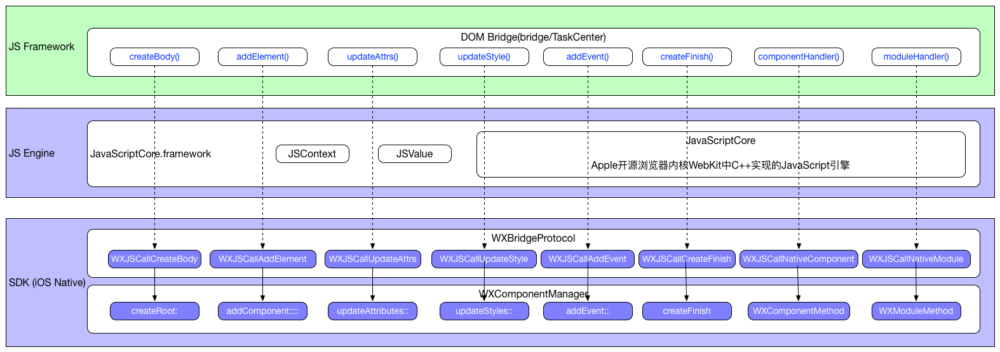

# 二、Weex SDK : Virtual DOM Bridge APIs

### 0、vDOM Bridge APIs概貌



### 1、从JS视角看vDOM Bridge API (JavaScript语法)

**vDOM Bridge API注册**

```
// html5/runtime/bridge/TaskCenter.js

export function init () {
  var DOM_METHODS = {
    createFinish: global.callCreateFinish,
    updateFinish: global.callUpdateFinish,
    refreshFinish: global.callRefreshFinish,
    createBody: global.callCreateBody,
    addElement: global.callAddElement,
    removeElement: global.callRemoveElement,
    moveElement: global.callMoveElement,
    updateAttrs: global.callUpdateAttrs,
    updateStyle: global.callUpdateStyle,
    addEvent: global.callAddEvent,
    removeEvent: global.callRemoveEvent
  };
  for (var name in DOM_METHODS) {
    TaskCenter.prototype[name] = DOM_METHODS[name];
  };
  TaskCenter.prototype.componentHandler = global.callNativeComponent;
  TaskCenter.prototype.moduleHandler = global.callNativeModule;
}
```

**vDOM Bridge API**

```
class TaskCenter {
  send (type, params, args, options) {
    const { action, component, ref, module, method } = params
    args = args.map(arg => this.normalize(arg))
    switch (type) {
      case 'dom':
        return this[action](this.instanceId, args)
      case 'component':
        return this.componentHandler(this.instanceId, ref, method, args, Object.assign({ component }, options))
      default:
        return this.moduleHandler(this.instanceId, module, method, args, options)
    }
  }
}
```

### 2、从OC视角看vDOM Bridge API实现 (Objective语法)


**WXComponentManager**

- `- (void)createFinish`
- `- (void)updateFinish`
- `- (void)refreshFinish`
- `- (void)createRoot:(NSDictionary *)data`
- `- (void)addComponent:(NSDictionary *)componentData toSupercomponent:(NSString *)superRef atIndex:(NSInteger)index appendingInTree:(BOOL)appendingInTree`
- `- (void)removeComponent:(NSString *)refs`
- `- (void)moveComponent:(NSString *)ref toSuper:(NSString *)superRef atIndex:(NSInteger)index`
- `- (void)updateAttributes:(NSDictionary *)attributes forComponent:(NSString *)refs`
- `- (void)updateStyles:(NSDictionary *)styles forComponent:(NSString *)ref`
- `- (void)addEvent:(NSString *)eventName toComponent:(NSString *)ref`
- `- (void)removeEvent:(NSString *)eventName fromComponent:(NSString *)ref`

**WXComponentMethod**

- `- (instancetype)initWithComponentRef:(NSString *)ref
                          methodName:(NSString *)methodName
                           arguments:(NSArray *)arguments
                            instance:(WXSDKInstance *)instance
`
- `- (void)invoke`

**WXModuleMethod**

- `- (instancetype)initWithModuleName:(NSString *)moduleName
                        methodName:(NSString *)methodName
                         arguments:(NSArray *)arguments
                           options:(NSDictionary *)options
                          instance:(WXSDKInstance *)instance
`
- `- (NSInvocation *)invoke`

参考文档：[Virtual DOM APIs](https://github.com/alibaba/weex/blob/aaa3c7c2cc4189e6ecbf89905cb7f859a7fd433a/doc/specs/virtual-dom-apis.md)
