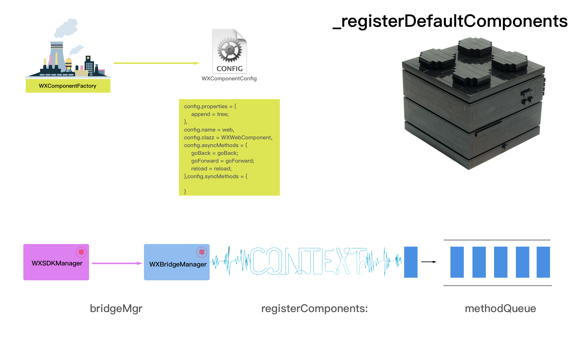
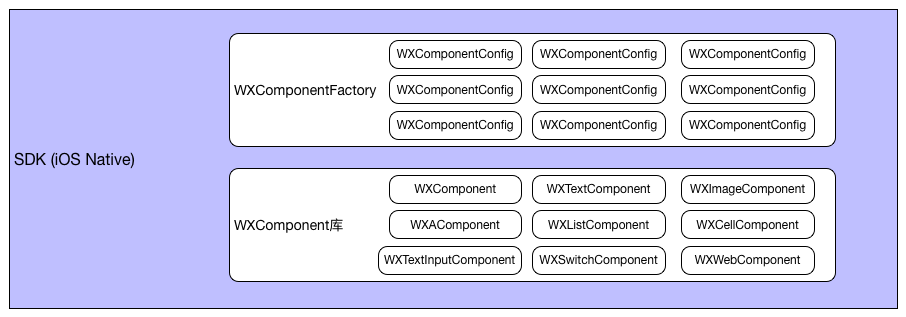
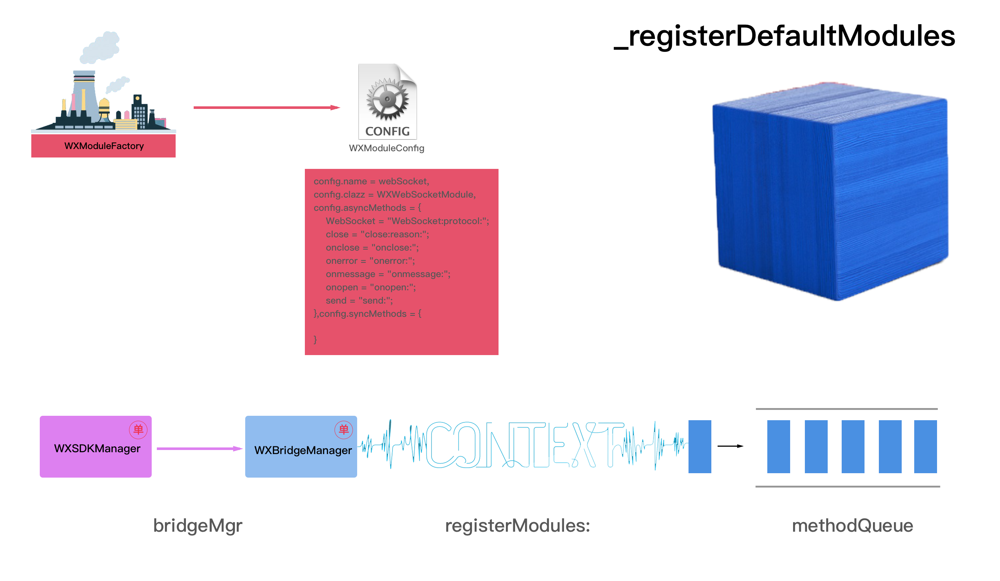
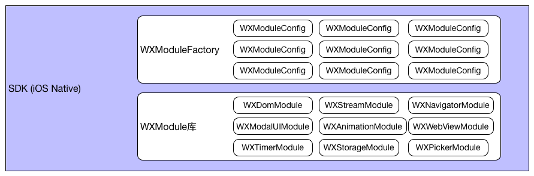
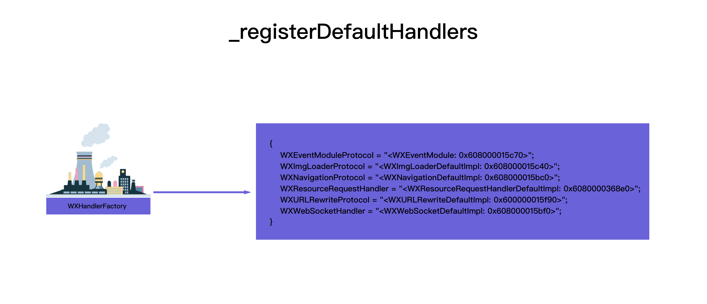
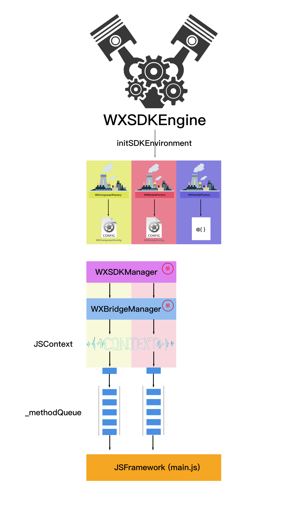
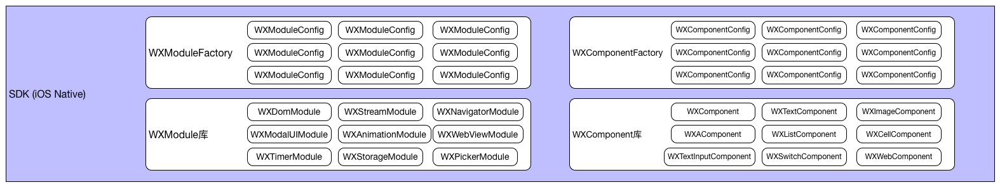

# Weex工作原理 - init - NA端

## NA端初始化

### 零、初始化入口

**```[WXSDKEngine initSDKEnvironment]```**

```
//注册组件、模块、Handlers
|-[WXSDKEngine  registerDefaults]
//1. 注册组件
|--[WXSDKEngine _registerDefaultComponents]
//2. 注册模块
|--[WXSDKEngine _registerDefaultModules]
//3. 注册Handler
|--[WXSDKEngine _registerDefaultHandlers]
//4. 加载JSFramework "native-bundle-main.js"
|-[WXBridgeManager executeJsFramework:] 
```

### 一、注册组件

* 1.1 函数调用

```
//注册组件
|--[WXSDKEngine _registerDefaultComponents]
|---[WXSDKEngine registerComponent:withClass:withProperties:]
//注册组件-在Native里注册 WXComponentFactory._componentConfigs
|----[WXComponentFactory registerComponent:withClass:withPros:]
|-----[[WXComponentConfig alloc] initWithName:class:pros:]
|-----[WXComponentConfig registerMethods] // WX_EXPORT_METHOD 和 WX_EXPORT_METHOD_SYNC
|-----_componentConfigs { key: name, value: WXComponentConfig }
```

* 1.2 调用图示



* 1.3 注册结果



### 二、注册模块

* 2.1 函数调用

```
//注册模块
|--[WXSDKEngine _registerDefaultModules]
|---[WXSDKEngine registerModule:withClass:]
//注册模块-在Native里注册 WXModuleFactory._moduleMap
|----[WXModuleFactory registerModule:withClass:]
|-----[WXModuleConfig registerMethods]
```

* 2.2 调用图示



* 2.3 注册结果



### 三、注册Handler

* 3.1 函数调用

```
//注册Handler
|--[WXSDKEngine _registerDefaultHandlers]
|---[WXSDKEngine registerHandler:withProtocol:]
//注册Handler-在Native里注册 WXHandlerFactory.handlers
|----[WXHandlerFactory registerHandler:withProtocol:]
```

* 3.2 调用图示




### 4、加载JS Framework

* 3.1 函数调用

```
//加载JSFramework "native-bundle-main.js"
|-[WXBridgeManager executeJsFramework:] 
|--[WXBridgeContext executeJsFramework:]
|---[WXJSCoreBridge executeJsFramework:]
|----[JSContext evaluateScript:withSourceURL:]
```

## 总结

* 总流程



* 总结果


