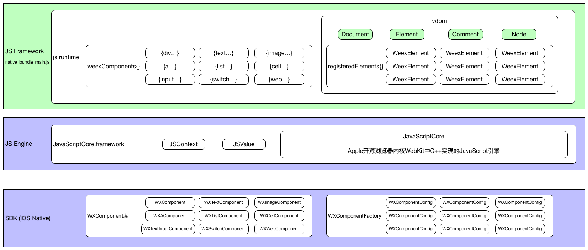
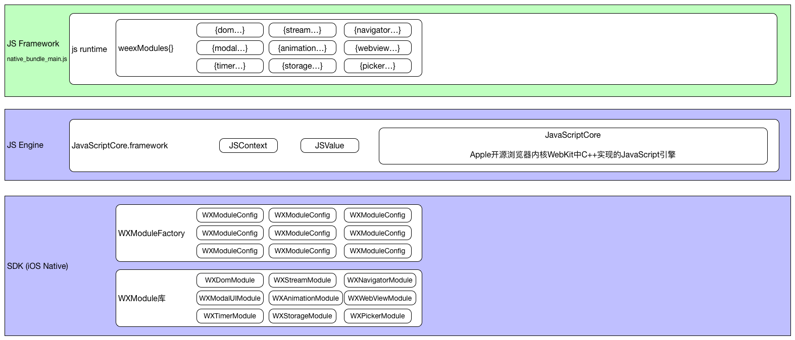

# Weex工作原理 - init - JS端 (组件和模块)

### 四、注册组件

* 4.1 NA端发起的函数调用

```
//注册组件
|--[WXSDKEngine _registerDefaultComponents]
|---[WXSDKEngine registerComponent:withClass:withProperties:]
//注册组件-在JS里注册 [JSContext globalObject]
|----[WXComponentFactory componentMethodMapsWithName:]
|----[WXBridgeManager registerComponents:]
jsThread @"com.taobao.weex.bridge"
|-----[WXBridgeContext registerComponents:]
|------[WXJSCoreBridge callJSMethod:@"registerComponents" args:]
|-------[[JSContext globalObject] invokeMethod:withArguments:]
```

* 4.2 JS端注册过程

```
// html5/runtime/component.js

const weexComponents = {}

function registerComponents (newComponents) {
  if (Array.isArray(newComponents)) {
    newComponents.forEach(component => {
      if (!component) {
        return
      }
      if (typeof component === 'string') {
        weexComponents[component] = true
      }
      else if (typeof component === 'object' && typeof component.type === 'string') {
        weexComponents[component.type] = component
        registerElement(component.type, component.methods)
      }
    })
  }
}
```

```
// html5/runtime/vdom/WeexElement.js

const registeredElements = {}

function registerElement (type, methods) {
  // Init constructor.
  class WeexElement extends Element {}

  // Add methods to prototype.
  methods.forEach(methodName => {
    WeexElement.prototype[methodName] = function (...args) {
      const taskCenter = getTaskCenter(this.docId)
      if (taskCenter) {
        return taskCenter.send('component', {
          ref: this.ref,
          component: type,
          method: methodName
        }, args)
      }
    }
  })

  // Add to element type map.
  registeredElements[type] = WeexElement
}
```

* 4.3 注册结果



### 五、注册模块

* 5.1 NA端发起的函数调用

```
//注册模块
|--[WXSDKEngine _registerDefaultModules]
|---[WXSDKEngine registerModule:withClass:]
//注册模块-在JS里注册 [JSContext globalObject]
|-----[WXModuleFactory moduleMethodMapsWithName:]
|-----[WXBridgeManager registerModules:]
|------[WXBridgeContext registerModules:]
|-------[WXBridgeContext callJSMethod:args:]
|--------[WXJSCoreBridge callJSMethod:@"registerModules"args:]
|---------[[JSContext globalObject] invokeMethod:withArguments:]
```

* 5.2 JS端注册过程

```
// html5/runtime/module.js

const weexModules = {}

export function registerModules (newModules) {
  for (const name in newModules) {
    if (!weexModules[name]) {
      weexModules[name] = {}
    }
    newModules[name].forEach(method => {
      if (typeof method === 'string') {
        weexModules[name][method] = true
      }
      else {
        weexModules[name][method.name] = method.args
      }
    })
  }
}
```

* 5.3 注册结果




