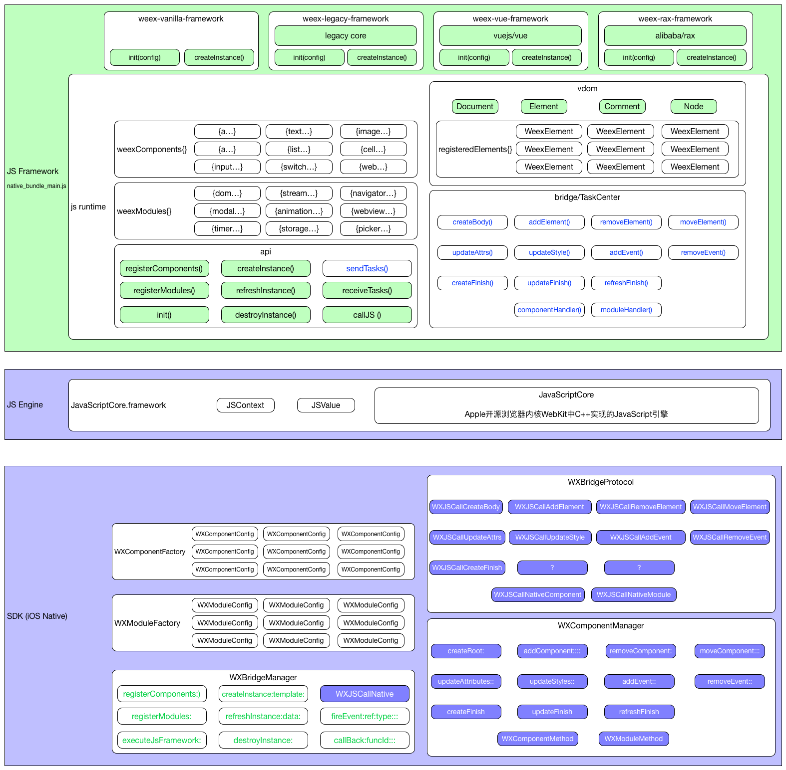

# Weex工作原理 - init完成

## 初始化

- Weex SDK初始化入口：```[WXSDKEngine initSDKEnvironment]```

- Weex SDK初始化逻辑：

```
//注册组件、模块、Handlers
|-[WXSDKEngine  registerDefaults]
//注册组件
|--[WXSDKEngine _registerDefaultComponents]
//注册模块
|--[WXSDKEngine _registerDefaultModules]
//注册Handler
|--[WXSDKEngine _registerDefaultHandlers]
//加载JSFramework "native-bundle-main.js"
|-[WXBridgeManager executeJsFramework:] 
```

## 初始化完成




