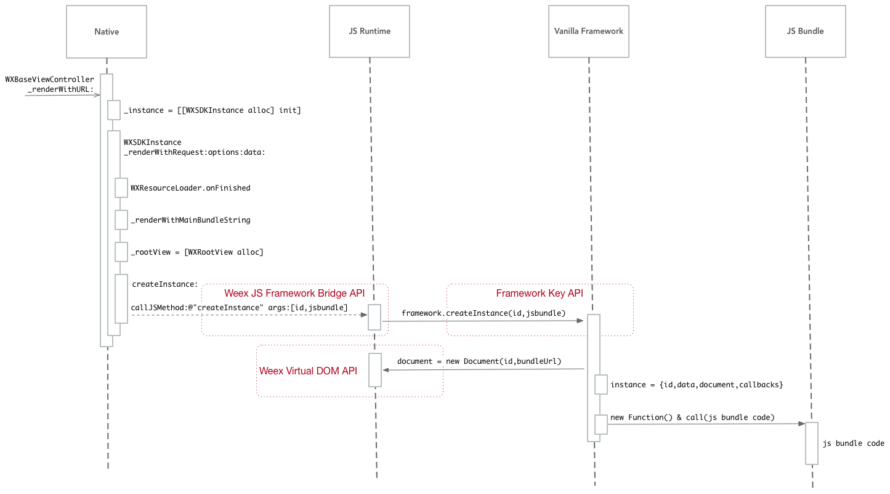

# Weex工作原理

## 四、Weex SDK : JS Bundle运行

### 1. 下载并执行JS Bundle

**视觉图**


**时序图**



**Native生成唯一的instanceId**

```_instance = [[WXSDKInstance alloc] init];```

```
@implementation WXSDKInstance
- (instancetype)init
{
    self = [super init];
    if(self){
        NSInteger instanceId = 0;
        @synchronized(self){
            static NSInteger __instance = 0;
            instanceId = __instance % (1024*1024);
            __instance++;
        }
        _instanceId = [NSString stringWithFormat:@"%ld", (long)instanceId];

        [WXSDKManager storeInstance:self forID:_instanceId];
    }
    return self;
}
@end
```

### 2. 示例JS Bundle

- vanilla example: ```incubator-weex/examples/vanilla/index.js```

```
// { "framework": "Vanilla" }

var body = document.createElement('div', {
  classStyle: { alignItems: 'center', marginTop: 120 }
})

var image = document.createElement('image', {
  attr: { src: 'https://alibaba.github.io/weex/img/weex_logo_blue@3x.png' },
  classStyle: { width: 360, height: 82 }
})

var text = document.createElement('text', {
  attr: { value: 'Hello World' },
  classStyle: { fontSize: 48 }
})

body.appendChild(image)
body.appendChild(text)
document.documentElement.appendChild(body)

body.addEvent('click', function () {
  text.setAttr('value', 'Hello Weex')
})
```

### 3. 示例Framework - Vanilla Framework

- weex-vanilla-framework: ```incubator-weex/html5/frameworks/vanilla/index.js```

```
const instanceMap = {}

function createInstance (id, code, options = {}, data = {}, serviceObjects = {}) {
  const document = new config.Document(id, options.bundleUrl)
  const instance = { id, data, document, callbacks }
  instanceMap[id] = instance

  const globalObjects = Object.assign({
    Document: config.Document,
    Element: config.Element,
    Comment: config.Comment,
    sendTasks: tasks => config.sendTasks(id, tasks, -1),
    options,
    document
  }, serviceObjects)

  const globalKeys = []
  const globalValues = []
  for (const key in globalObjects) {
    globalKeys.push(key)
    globalValues.push(globalObjects[key])
  }
  globalKeys.push(code)

  // 执行JS Bundle中代码
  const result = new Function(...globalKeys)
  result(...globalValues)

  config.sendTasks(id, [{ module: 'dom', method: 'createFinish', args: [] }], -1)

  return instance
}
```

### 4. new Function()语法 [在线示例](https://developer.mozilla.org/zh-CN/docs/Web/JavaScript/Reference/Global_Objects/Function)

```
var sum = new Function('a', 'b', 'return a + b');
```

等价于

```
var function sum(a,b) {
	return a + b
}
```

### 5. 关键代码解析：

```
const function sendTasksFunc(tasks){ config.sendTasks(id, tasks, -1) }
const globalKeys = [Document, Element, Comment, sendTasks, options, document, code]
const globalValues = [config.Document,config.Element,config.Comment, sendTasksFunc, options, document]

const resultFunc = new Function(...globalKeys)
resultFunc(...globalValues)
```

等价于

```
const function sendTasksFunc(tasks){ config.sendTasks(id, tasks, -1) }

const resultFunc = new Function(Document, Element, Comment, sendTasks, options, document, code)
resultFunc(config.Document,config.Element,config.Comment, sendTasksFunc, options, document)
```

等价于

```
const function sendTasksFunc(tasks){ return config.sendTasks(id, tasks, -1) }

const function resultFunc(Document, Element, Comment, sendTasks, options, document) {
  code /*code as resultFunc's function body*/
}
resultFunc(config.Document,config.Element,config.Comment, sendTasksFunc, options, document)
```

等价于

```
const function sendTasksFunc(tasks){ return config.sendTasks(id, tasks, -1) }

const function resultFunc(Document, Element, Comment, sendTasks, options, document) {
	// { "framework": "Vanilla" }

	var body = document.createElement('div', {
	  classStyle: { alignItems: 'center', marginTop: 120 }
	})

	var image = document.createElement('image', {
	  attr: { src: 'https://alibaba.github.io/weex/img/weex_logo_blue@3x.png' },
	  classStyle: { width: 360, height: 82 }
	})

	var text = document.createElement('text', {
	  attr: { value: 'Hello World' },
	  classStyle: { fontSize: 48 }
	})

	body.appendChild(image)
	body.appendChild(text)
	document.documentElement.appendChild(body)

	body.addEvent('click', function () {
	  text.setAttr('value', 'Hello Weex')
	})
}
resultFunc(config.Document,config.Element,config.Comment, sendTasksFunc, options, document)
```

### 6. 总结：JS Bundle + Weex-Vanilla-Framework

```
const instanceMap = {}

function createInstance (id, code, options = {}, data = {}, serviceObjects = {}) {
  const document = new config.Document(id, options.bundleUrl)
  const instance = { id, data, document, callbacks }
  instanceMap[id] = instance

  const function sendTasksFunc(tasks){ return config.sendTasks(id, tasks, -1) }

  const function resultFunc(Document, Element, Comment, sendTasks, options, document) {
  	// { "framework": "Vanilla" }

  	var body = document.createElement('div', {
  	  classStyle: { alignItems: 'center', marginTop: 120 }
  	})

  	var image = document.createElement('image', {
  	  attr: { src: 'https://alibaba.github.io/weex/img/weex_logo_blue@3x.png' },
  	  classStyle: { width: 360, height: 82 }
  	})

  	var text = document.createElement('text', {
  	  attr: { value: 'Hello World' },
  	  classStyle: { fontSize: 48 }
  	})

  	body.appendChild(image)
  	body.appendChild(text)
  	document.documentElement.appendChild(body)

  	body.addEvent('click', function () {
  	  text.setAttr('value', 'Hello Weex')
  	})
  }
  resultFunc(config.Document,config.Element,config.Comment, sendTasksFunc, options, document)

  config.sendTasks(id, [{ module: 'dom', method: 'createFinish', args: [] }], -1)

  return instance
}
```

参考文档: [js-bundle-format.md](https://github.com/alibaba/weex/blob/aaa3c7c2cc4189e6ecbf89905cb7f859a7fd433a/doc/specs/js-bundle-format.md)
