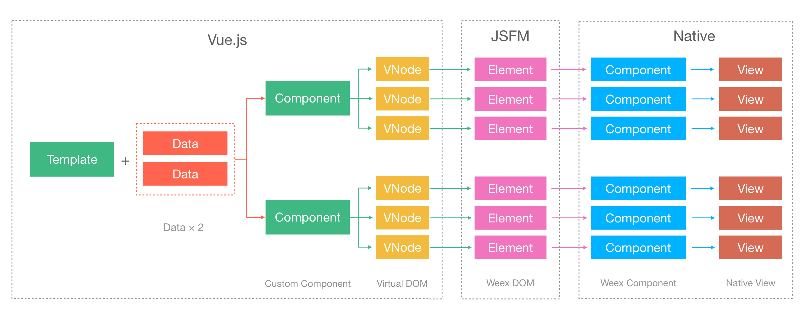
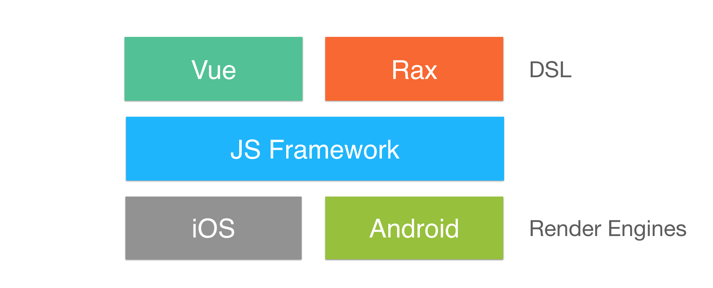

# 课后练习

### 问题：能看懂这张图吗？

### 问题：能看懂这张图吗？

### 问题：能看懂这篇文章吗？

Weex JS Framework负责人视角(2018-03-16): [重新介绍 Weex (JS Framework)](https://yq.aliyun.com/articles/543724?spm=5176.10695662.1996646101.searchclickresult.3ed661d4r4o1S5) 

