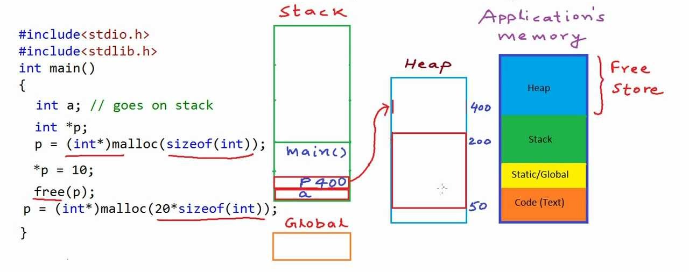
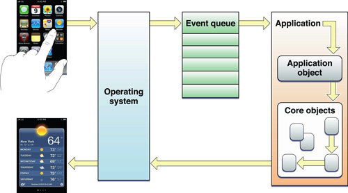

# Weex工作原理

## 二、知识准备 - JavaScript和Native

### 2.1 JavaScript Runtime

***[JavaScript内存可视化描述](https://developer.mozilla.org/zh-CN/docs/Web/JavaScript/EventLoop)(Stack + Heap + Queue)***


***JavaScript Event Loop***

```
while (queue.waitForMessage()) {
  queue.processNextMessage();
}
```

### 2.2 Native Runtime

***Native C Runtime内存(Stack + Heap)***



***iOS Event Loop(Queue)***



