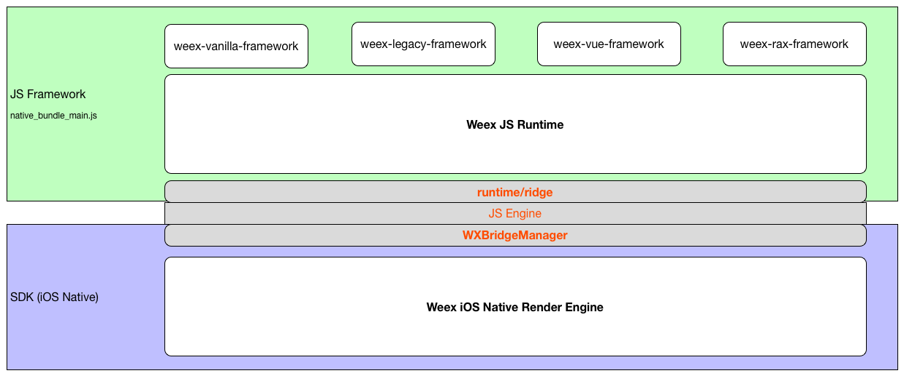
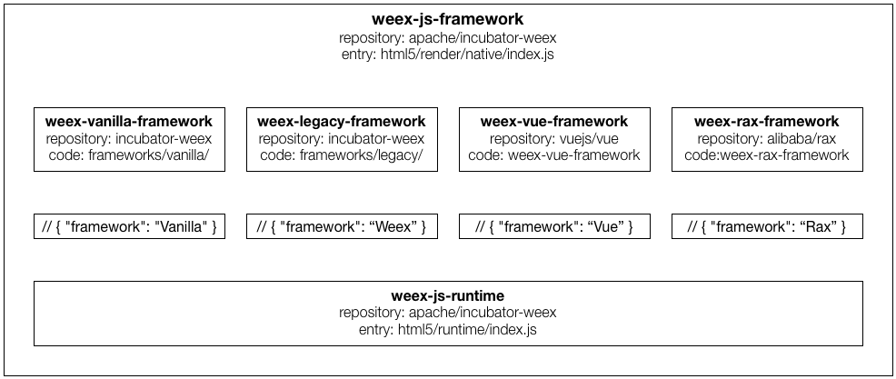
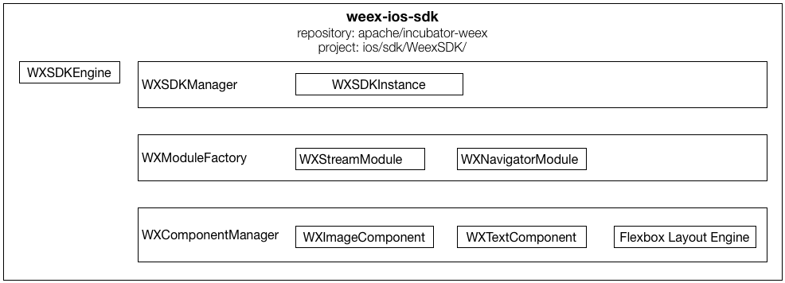

# Weex工作原理


## 二、WeexSDK整体结构

### 2.0 Weex SDK整体结构



### 2.1 JS Framework结构

***JS Framework代码***

* 源码版：```incubator-weex/html5/*/*.js```
* 发布版：```incubator-weex/pre-build/native-bundle-main.js``` 简称 main.js

***JS Framework代码结构***



### 2.2 iOS Native结构

***iOS Native代码***

* 源代码：```incubator-weex/ios/sdk/WeexSDK/Sources/*.m/.mm```

***iOS Native代码结构***



