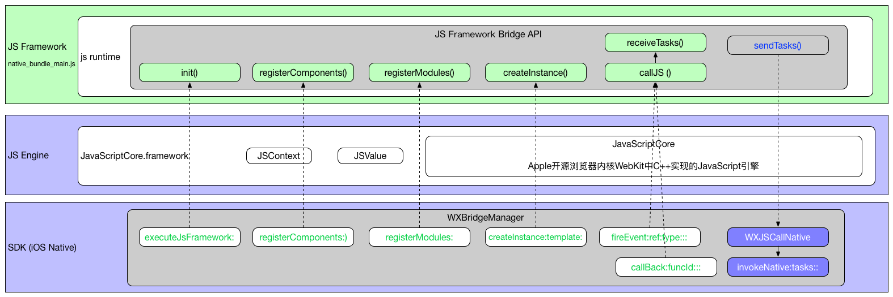
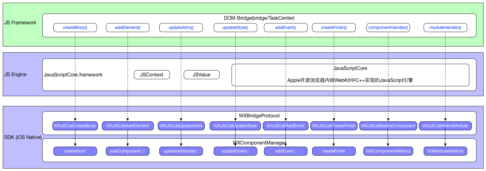
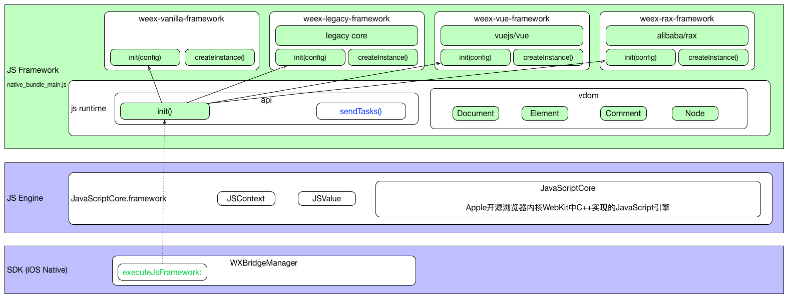

# Weex工作原理 - init - JS端 (Bridge和Framework)

## JS端初始化

### 零、加载JS Framework - JS Framework初始化入口

```
//加载JSFramework "native-bundle-main.js"
|-[WXBridgeManager executeJsFramework:] 
|--[WXBridgeContext executeJsFramework:]
|---[WXJSCoreBridge executeJsFramework:]
|----[JSContext evaluateScript:withSourceURL:]
```

**```native-bundle-main.js```**

* 源码：```incubator-weex/html5/*/*.js```
* 入口：```incubator-weex/html5/render/native/index.js```

```
import * as Vanilla from './vanilla/index'
import * as Weex from './legacy/index'
import * as Vue from 'weex-vue-framework'
import Rax from 'weex-rax-framework'

var frameworks = {
  Vanilla,
  Vue,
  Rax,
  Weex
}

setup(frameworks)
```

* 源码：```setup.js```

```
function (frameworks) {
  // init TaskCenter
  initTaskHandler()
  
  // init frameworks and export JS Framework Bridge APIs
  const globalMethods = init(config) // runtime/init.js

  // set global methods
  for (const methodName in globalMethods) {
    global[methodName] = (...args) => {
      const ret = globalMethods[methodName](...args)
      return ret
    }
  }
}
```

### 一、注册JS Framework Bridge APIs

* 1. 源码：```incubator-weex/html5/runtime/api/init.js```

```
const methods = {
  createInstance,
  registerService: register,
  unregisterService: unregister,
  callJS (id, tasks) {
    const framework = frameworks[getFrameworkType(id)]
    if (framework && typeof framework.receiveTasks === 'function') {
      return framework.receiveTasks(id, tasks)
    }
    return receiveTasks(id, tasks)
  }
}

function init (config) {

  adaptMethod('registerComponents', registerComponents)
  adaptMethod('registerModules', registerModules)
  adaptMethod('registerMethods')

  ; ['destroyInstance', 'refreshInstance', 'getRoot'].forEach(genInstance)

  return methods
}
```

* 2. 注册结果




### 二、注册vDOM Bridge APIs

* 1. 源码：```incubator-weex/html5/runtime/bridge/TaskCenter.js```

```
// html5/runtime/bridge/TaskCenter.js

export function init () {
  var DOM_METHODS = {
    createFinish: global.callCreateFinish,
    updateFinish: global.callUpdateFinish,
    refreshFinish: global.callRefreshFinish,
    createBody: global.callCreateBody,
    addElement: global.callAddElement,
    removeElement: global.callRemoveElement,
    moveElement: global.callMoveElement,
    updateAttrs: global.callUpdateAttrs,
    updateStyle: global.callUpdateStyle,
    addEvent: global.callAddEvent,
    removeEvent: global.callRemoveEvent
  };
  for (var name in DOM_METHODS) {
    TaskCenter.prototype[name] = DOM_METHODS[name];
  };
  TaskCenter.prototype.componentHandler = global.callNativeComponent;
  TaskCenter.prototype.moduleHandler = global.callNativeModule;
}
```

* 2. vDOM Bridge API使用

vDOM模块又将基本的Bridge API封装成TaskCenter.send()方法供其它JS代用。

```
class TaskCenter {
  send (type, params, args, options) {
    const { action, component, ref, module, method } = params
    args = args.map(arg => this.normalize(arg))
    switch (type) {
      case 'dom':
        return this[action](this.instanceId, args)
      case 'component':
        return this.componentHandler(this.instanceId, ref, method, args, Object.assign({ component }, options))
      default:
        return this.moduleHandler(this.instanceId, module, method, args, options)
    }
  }
}
```

* 3. 注册结果




### 三、初始化所有的Frameworks

* 0. 发起初始化：```incubator-weex/html5/runtime/api/init.js```

```
// incubator-weex/html5/runtime/api/init.js

function init (config) {
  runtimeConfig = config || {}
  frameworks = runtimeConfig.frameworks || {}
  initTaskHandler()

  // Init each framework by `init` method and `config` which contains three
  // virtual-DOM Class: `Document`, `Element` & `Comment`, and a JS bridge method:
  // `sendTasks(...args)`.
  for (const name in frameworks) {
    const framework = frameworks[name]
    framework.init(config)
  }
}
```

* 1. weex-vanilla-framework初始化

```
// incubator-weex/html5/frameworks/vanilla/index.js

const config = {}

export function init (cfg) {
  config.Document = cfg.Document
  config.Element = cfg.Element
  config.Comment = cfg.Comment
  config.sendTasks = cfg.sendTasks
}
```

* 2. weex-legacy-framework初始化

```
// incubator-weex/html5/frameworks/legacy/config.js
var config = {
  nativeComponentMap: {
    text: true,
    image: true,
    container: true,
    slider: {
      type: 'slider',
      append: 'tree'
    },
    cell: {
      type: 'cell',
      append: 'tree'
    }
  }
}

// incubator-weex/html5/frameworks/legacy/static/life.js
function init (cfg) {
  config.Document = cfg.Document
  config.Element = cfg.Element
  config.Comment = cfg.Comment
  config.sendTasks = cfg.sendTasks
  config.Listener = cfg.Listener
}
```

* 3. weex-vue-framework初始化

```
// incubator-weex/node_modules/weex-vue-framework/index.js
var renderer = {
  TextNode: TextNode,
  instances: instances,
  modules: modules,
  components: components
};

// Prepare framework config, basically about the virtual-DOM and JS bridge.
function init (cfg) {
  renderer.Document = cfg.Document;
  renderer.Element = cfg.Element;
  renderer.Comment = cfg.Comment;
  renderer.compileBundle = cfg.compileBundle;
}
```

* 4. weex-rax-framework初始化(略)

***总结***

各Framework的初始化基本都是引入weex js runtime层的vDOM类(Document, Element等)和sendTasks->global.callNative接口。



