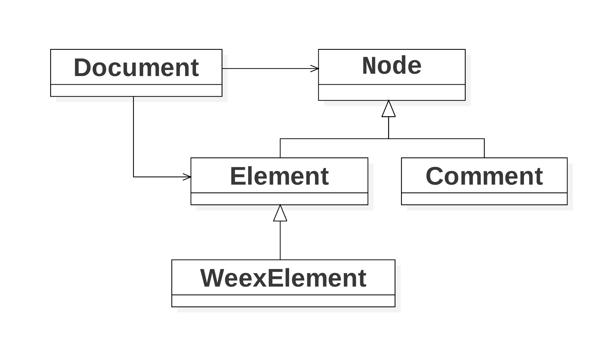
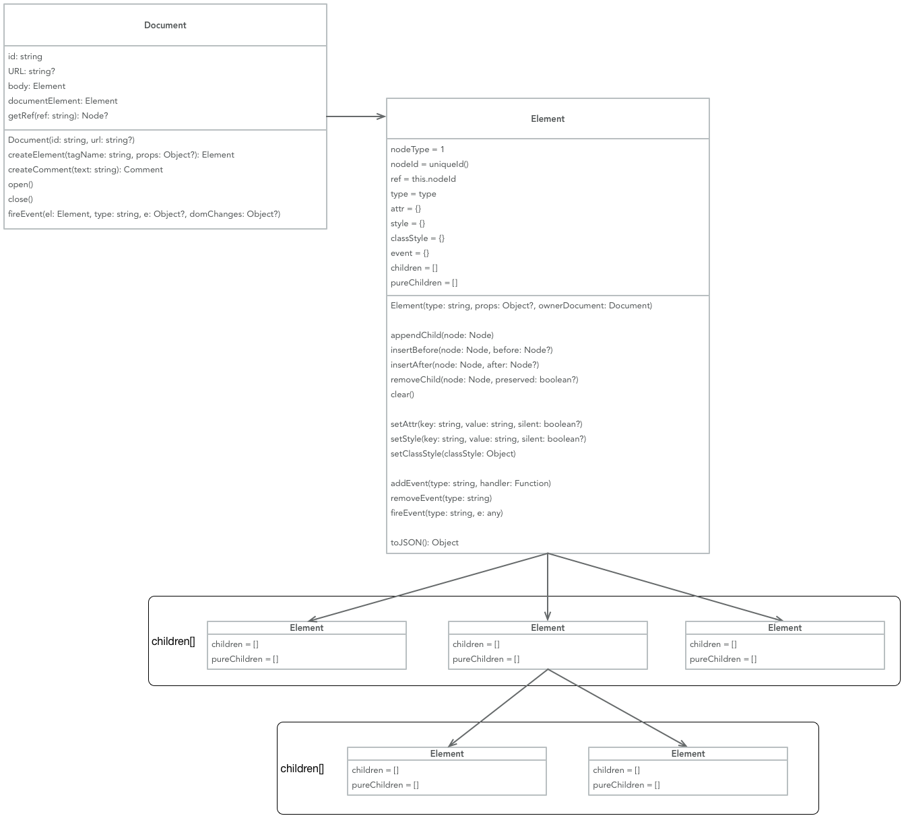
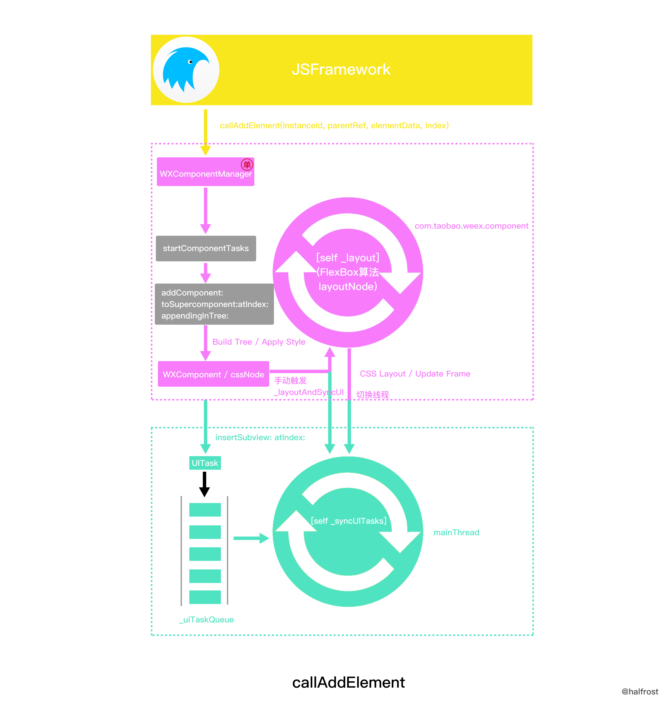
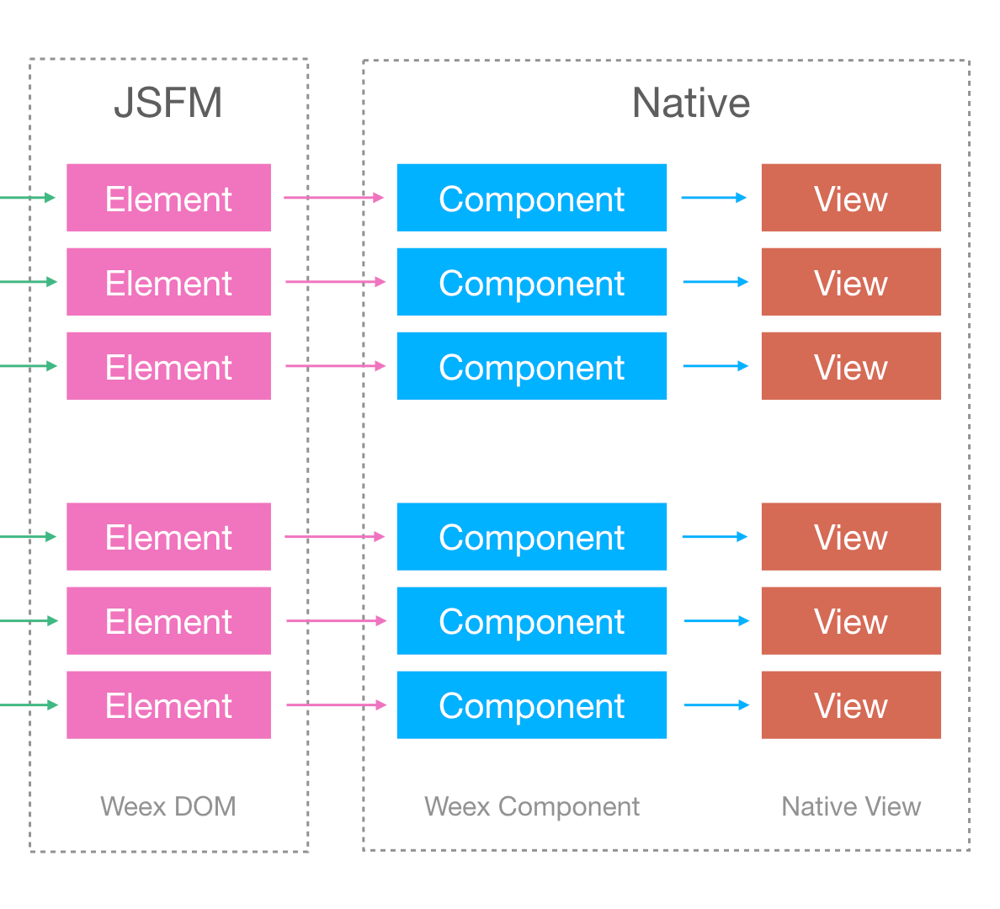

# 四、Weex SDK : JS Bundle运行

### 1. Weex vDOM 类图



### 2. 构建 vDOM Tree



### 3、渲染 vDOM Tree

**3.1 vDOM Tree -> Native Component Tree**

- 关键代码 (incubator-weex v0.17版本) 

```
// html5/runtime/bridge/TaskCenter.js
TaskCenter.prototype[addElement] = global.callAddElement;
```

```
// WXComponentManager.m
[_jsBridge registerCallAddElement:^NSInteger(NSString *instanceId, NSString *parentRef, NSDictionary *elementData, NSInteger index) {
        WXPerformBlockOnComponentThread(^{
            [manager addComponent:elementData toSupercomponent:parentRef atIndex:index appendingInTree:NO];
        });        
}];

- (void)addComponent:(NSDictionary *)componentData toSupercomponent:(NSString *)superRef atIndex:(NSInteger)index appendingInTree:(BOOL)appendingInTree;
```

**3.2 Native Component Tree -> Native View Tree**

- 关键代码 (incubator-weex v0.17版本) 

```
@implementation WXComponentManager

- (void)_layoutAndSyncUI
{
    [self _layout];
    if(_uiTaskQueue.count > 0){
        [self _syncUITasks];
        _noTaskTickCount = 0;
    } else {
        // suspend display link when there's no task for 1 second, in order to save CPU time.
        _noTaskTickCount ++;
        if (_noTaskTickCount > 60) {
            [self _suspendDisplayLink];
        }
    }
}

- (void)_syncUITasks
{
    NSArray<dispatch_block_t> *blocks = _uiTaskQueue;
    _uiTaskQueue = [NSMutableArray array];
    dispatch_async(dispatch_get_main_queue(), ^{
        for(dispatch_block_t block in blocks) {
            block();
        }
    });
}

- (void)createRoot:(NSDictionary *)data
{
    [self _addUITask:^{
        strongSelf.weexInstance.rootView.wx_component = strongSelf->_rootComponent;
        [strongSelf.weexInstance.rootView addSubview:strongSelf->_rootComponent.view];
    }];       
}

- (void)_recursivelyAddComponent:(NSDictionary *)componentData toSupercomponent:(WXComponent *)supercomponent atIndex:(NSInteger)index appendingInTree:(BOOL)appendingInTree
{
    if (!component->_isTemplate) {
        [self _addUITask:^{
            [supercomponent insertSubview:component atIndex:index];
        }];
    }
}

- (void)moveComponent:(NSString *)ref toSuper:(NSString *)superRef atIndex:(NSInteger)index
{
    [component _moveToSupercomponent:newSupercomponent atIndex:index];
    [self _addUITask:^{
        [component moveToSuperview:newSupercomponent atIndex:index];
    }];
}

@end
```

**3.3 执行过程**



**3.4 设计思路**




