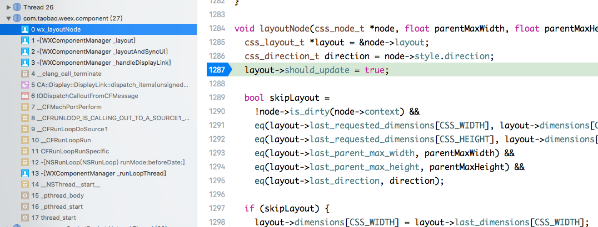
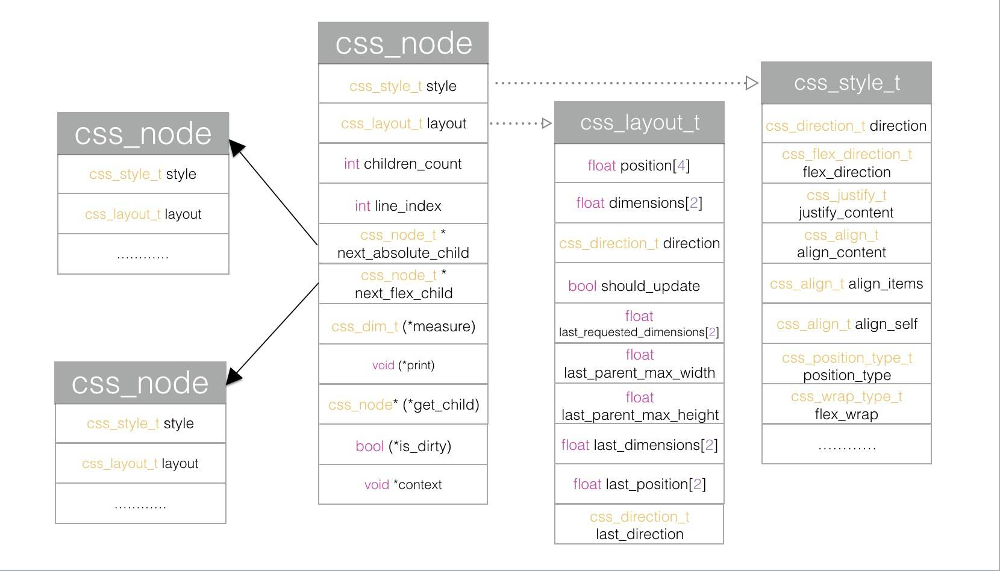

# 四、Weex工作原理 - 界面布局

## 4.1、Weex App界面布局原理

### 安装CADisplayLink回调

```
@implementation WXComponentManager
- (void)_startDisplayLink
{
	_displayLink = [CADisplayLink displayLinkWithTarget:self selector:@selector(_handleDisplayLink)];
	[_displayLink addToRunLoop:[NSRunLoop currentRunLoop] forMode:NSDefaultRunLoopMode];
}

- (void)_handleDisplayLink
{
    WXAssertComponentThread();    
    [self _layoutAndSyncUI];
}
@end
```

### 触发Layout的调用序列

```

// incubator-weex/ios/sdk/WeexSDK/Sources/Manager/WXComponentManager.m:818
|-[WXComponentManager _handleDisplayLink]
    -[WXComponentManager _layoutAndSyncUI]
        -[WXComponentManager _layout]
// incubator-weex/ios/sdk/WeexSDK/Sources/Layout/Layout.c:1287
          wx_layoutNode (WX_LAYOUT_PREFIX(layoutNode))
```

```
#define WX_LAYOUT_NAMESPACE wx_
#define WX_LAYOUT_PREFIX(symbol) WX_NAMESPACE_PREFIX(WX_LAYOUT_NAMESPACE, symbol)
#define layoutNode WX_LAYOUT_PREFIX(layoutNode)
```

### Layout触发的调用栈



```
com.taobao.weex.component
wx_layoutNode() at incubator-weex/ios/sdk/WeexSDK/Sources/Layout/Layout.c:1287
-[WXComponentManager _layout]
-[WXComponentManager _layoutAndSyncUI]
-[WXComponentManager _handleDisplayLink]
__clang_call_terminate ()
-[NSRunLoop(NSRunLoop) runMode:beforeDate:] ()
-[WXComponentManager _runLoopThread]
__NSThread__start__ ()
thread_start ()
```

## 4.2 Layout Engine - Facebook开源的flexbox布局引擎

***数据结构***



***布局流程***  [图示layoutNodeImpl.png](layoutNodeImpl.png)

参考文档：[由 FlexBox 算法强力驱动的 Weex 布局引擎](https://halfrost.com/weex_flexbox/)


