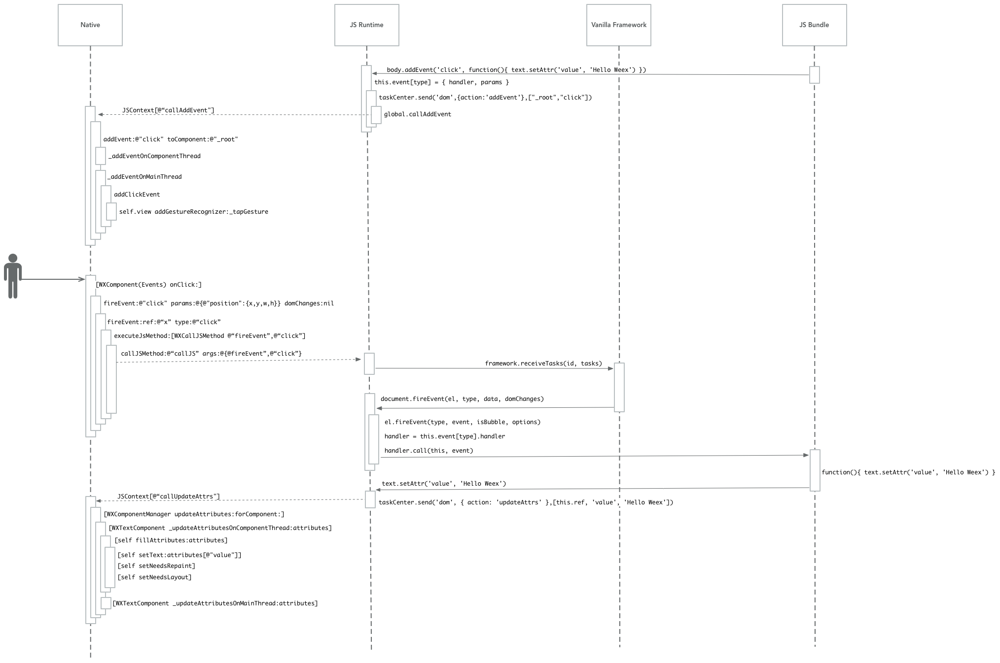

# Weex工作原理

## 四、Weex SDK : JS Bundle用户交互

### 关键代码-NA端

```
@implementation WXComponentManager
- (void)addEvent:(NSString *)eventName toComponent:(NSString *)ref
{
    WXComponent *component = [_indexDict objectForKey:ref];
    [component _addEventOnComponentThread:eventName];    
    [self _addUITask:^{
        [component _addEventOnMainThread:eventName];
    }];
}
- (void)_addEventOnComponentThread:(NSString *)eventName
{
    [_events addObject:eventName];
}
@end
```

```
@implementation WXComponent (Events)
- (void)_addEventOnMainThread:(NSString *)addEventName
{
    if (![self isViewLoaded]) {
        //This action will be ignored While the view is loaded,
        //then it will initEvent according to the records in _events
        return;
    }
    WX_ADD_EVENT(appear, addAppearEvent)
    WX_ADD_EVENT(disappear, addDisappearEvent)
    
    WX_ADD_EVENT(click, addClickEvent)
    WX_ADD_EVENT(swipe, addSwipeEvent)
    WX_ADD_EVENT(longpress, addLongPressEvent)
    
    WX_ADD_EVENT(panstart, addPanStartEvent)
    WX_ADD_EVENT(panmove, addPanMoveEvent)
    WX_ADD_EVENT(panend, addPanEndEvent)
    
    WX_ADD_EVENT(horizontalpan, addHorizontalPanEvent)
    WX_ADD_EVENT(verticalpan, addVerticalPanEvent)
    
    WX_ADD_EVENT(touchstart, addTouchStartEvent)
    WX_ADD_EVENT(touchmove, addTouchMoveEvent)
    WX_ADD_EVENT(touchend, addTouchEndEvent)
    WX_ADD_EVENT(touchcancel, addTouchCancelEvent)
    WX_ADD_EVENT(accessibilityMagicTap, addAccessibilityMagicTapEvent)
    
    if(_isListenPseudoTouch) {
        self.touchGesture.listenPseudoTouch = YES;
    }
    
    [self addEvent:addEventName];
}

- (void)addClickEvent
{
    if (!_tapGesture) {
        _tapGesture = [[UITapGestureRecognizer alloc] initWithTarget:self action:@selector(onClick:)];
        _tapGesture.delegate = self;
        [self.view addGestureRecognizer:_tapGesture];
    }
}

- (void)onClick:(__unused UITapGestureRecognizer *)recognizer
{
    NSMutableDictionary *position = [[NSMutableDictionary alloc] initWithCapacity:4];
    CGFloat scaleFactor = self.weexInstance.pixelScaleFactor;
    if (!CGRectEqualToRect(self.view.frame, CGRectZero)) {
        CGRect frame = [self.view.superview convertRect:self.view.frame toView:self.view.window];
        position[@"x"] = @(frame.origin.x/scaleFactor);
        position[@"y"] = @(frame.origin.y/scaleFactor);
        position[@"width"] = @(frame.size.width/scaleFactor);
        position[@"height"] = @(frame.size.height/scaleFactor);
    }

    [self fireEvent:@"click" params:@{@"position":position}];
}
@end
```

```
WX_ADD_EVENT(click, addClickEvent)
```
等价于

```
if ([addEventName isEqualToString:@"click"]) {
    [self addClickEvent];
}
```

### 关键代码-JS端

```
// html5/frameworks/vanilla/index.js

function receiveTasks (id, tasks) {
  const jsHandlers = {
    fireEvent: (id, ref, type, data, domChanges) => {
      const { document } = instanceMap[id]
      const el = document.getRef(ref)
      return document.fireEvent(el, type, data, domChanges)
    },

    callback: (id, funcId, data, ifLast) => {
      const { document } = instanceMap[id]
      return document.handleCallback(funcId, data, ifLast)
    }
  }

  const { document } = instanceMap[id] || {}
  if (document && Array.isArray(tasks)) {
    const results = []
    tasks.forEach((task) => {
      const handler = jsHandlers[task.method]
      const args = [...task.args]
      if (typeof handler === 'function') {
        args.unshift(id)
        results.push(handler(...args))
      }
    })
    return results
  }
}
```

### 时序图



### 日志

```
2018-10-21 09:41:58.731572+0800 WeexDemo[14552:2019161] <Weex>[debug]WXJSCoreBridge.m:197, Calling JS... method:callJS, args:(
    2,
        (
                {
            args =             (
                "_root",
                click,
                                {
                    position =                     {
                        height = "1217.391304347826";
                        width = "749.9999999999999";
                        x = 0;
                        y = "236.1111111111111";
                    };
                    timestamp = "1540086118729.778";
                },
                                {
                }
            );
            method = fireEvent;
            module = "";
        }
    )
)
2018-10-21 09:41:58.734033+0800 WeexDemo[14552:2019161] <Weex>[debug]WXJSCoreBridge.m:292, callUpdateAttrs...2, 64, {
    value = "Hello Weex";
}
{layout: {width: 414, height: 672, top: 0, left: 0}, flexDirection: 'column', alignItems: 'stretch', flex: 0, width: 414, height: 672, left: 0, top: 0, children: [
  {_root:div layout: {width: 414, height: 672, top: 66.24, left: 0}, flexDirection: 'column', alignItems: 'center', flex: 0, marginTop: 66.24, marginStart: nan, marginEnd: nan, width: 414, height: 672, children: [
    {62:image layout: {width: 198.72, height: 45.264, top: 0, left: 107.64}, flexDirection: 'column', alignItems: 'stretch', flex: 0, width: 198.72, height: 45.264, },
    {64:text layout: {width: 125, height: 31.6667, top: 45.264, left: 144.5}, flexDirection: 'column', alignItems: 'stretch', flex: 0, },
  ]},
]},
```


参考文档：[Weex 事件传递的那些事儿](https://halfrost.com/weex_event/)
